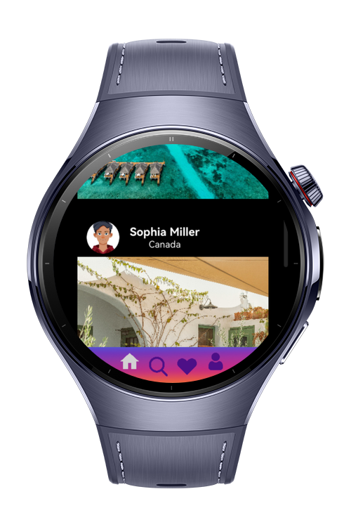
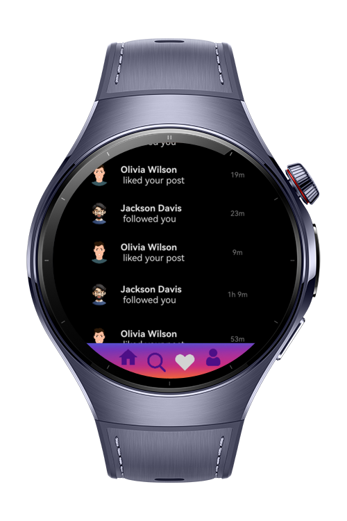

> **Note:** To access all shared projects, get information about environment setup, and view other guides, please visit [Explore-In-HMOS-Wearable Index](https://github.com/Explore-In-HMOS-Wearable/hmos-index).

# SocialMedia Wearable

Wearable-Sample App of Social Media is a smartwatch application built with HarmonyOS ArkTS/ArkUI, designed to give users
quick and intuitive access and reaction to social media timeline. With a clean interface and simple navigation, Social
Media app. Lets you browse timeline, notifications, and react—all from your wearable device.

# Preview
<div>
    
    
    
    
</div>

# Use Cases

- **Splash Page**: Welcome page of application
- **Menu Page**: First Menu
- **Main Page**: Navigation Container
- **Home Page**: Timeline
- **Search Page**: Search Page
- **Notification Page**: Notification Page
- **Profile Page**: Profile Page

# Tech Stack

- **Languages**: ArkTS
- **Frameworks**: HarmonyOS SDK 5.0.0(12)
- **Libraries**: @kit.ArkUI, @kit.ArkData

# Directory Structure

```
ets
├─ CommonConstants.ets
├─ NavigationRouter.ets
├─ RouterUtils.ets
├─ Utils.ets
├─ components
│  ├─ ChatListItem.ets
│  ├─ CommenItem.ets
│  ├─ CommentInput.ets
│  ├─ DMDetailPageHeader.ets
│  ├─ DmInputComponent.ets
│  ├─ ExploreGridComponent.ets
│  ├─ FollowNotification.ets
│  ├─ LikeNotification.ets
│  ├─ MessageListComponent.ets
│  ├─ MultipleLikeNotification.ets
│  ├─ MyProfileInfoComponent.ets
│  ├─ NotificationGroup.ets
│  ├─ PostItem.ets
│  ├─ ProfileInfoComponent.ets
│  ├─ ProfileMentionedPostsGridComponent.ets
│  ├─ ProfilePostsGridComponent.ets
│  ├─ ProfilePostsTabComponent.ets
│  ├─ ProfileStoriesComponent.ets
│  ├─ SearchBarComponent.ets
│  ├─ SectionTitle.ets
│  ├─ TopBarComponent.ets
├─ entryability
│  └─ EntryAbility.ets
├─ entrybackupability
│  └─ EntryBackupAbility.ets
├─ model
│  ├─ ChatData.ets
│  ├─ ChatDetailData.ets
│  ├─ CommentData.ets
│  ├─ CommentResponse.ets
│  ├─ LocalMedia.ets
│  ├─ NotificationModel.ets
│  ├─ PostData.ets
│  ├─ ProfileData.ets
│  ├─ ProfileResponse.ets
│  ├─ sendMessage.ets
│  ├─ StorageManager.ets
│  ├─ UserData.ets
│  ├─ WsMessageResponse.ets
│  ├─ WsNotificationData.ets
│  
│  
│   
├─ pages
│  ├─ DirectMessageDetailPage.ets
│  ├─ DirectMessagePage.ets
│  ├─ EditProfilePage.ets
│  ├─ ExplorePage.ets
│  ├─ ExplorePageListView.ets
│  ├─ HomePage.ets
│  ├─ MainPage.ets
│  ├─ MenuPage.ets
│  ├─ NewPostPage.ets
│  ├─ NotificationPage.ets
│  ├─ PostDetailPage.ets
│  ├─ ProfilePage.ets
│  ├─ Splash.ets
│  ├─ StartupPage.ets
│  ├─ StickyPage.ets
│  └─ UserPage.ets
├─ service
│  ├─ CommentService.ets
│  ├─ DirectMessageService.ets
│  ├─ ExploreService.ets
│  ├─ MediaService.ets
│  ├─ NotificationService.ets
│  ├─ PostService.ets
│  └─ UserService.ets
├─ utils
│  └─ WaterFlowDataSource.ets
└─ viewmodel
   ├─ DirectMessageViewModel.ets
   ├─ ExploreViewModel.ets
   ├─ NewPostViewModel.ets
   ├─ NotificationViewModel.ets
   ├─ PostViewModel.ets
   └─ ProfileViewModel.ets
```

# Constraints and Restrictions

- CompatibleSDKVersion: 5.0.0(12)

## Supported Devices

- Huawei Watch 5

# License

**Social Media of wearable** is distributed under the terms of the MIT License
See the [LICENSE](./LICENSE) for more information.
