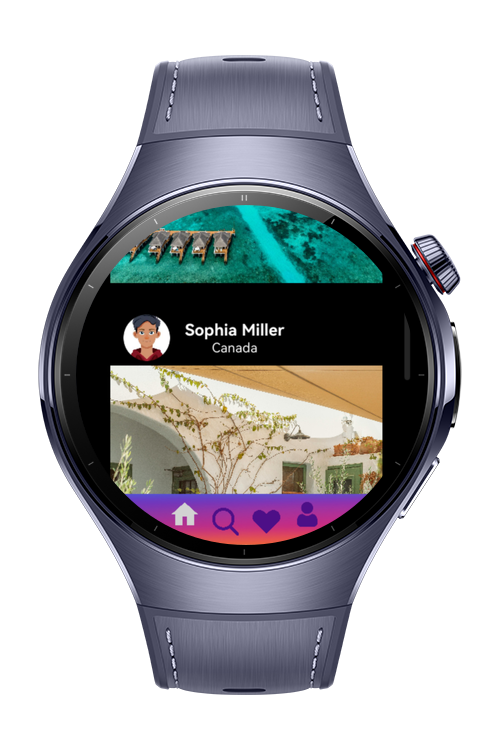
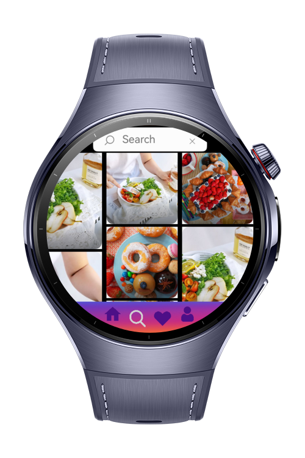
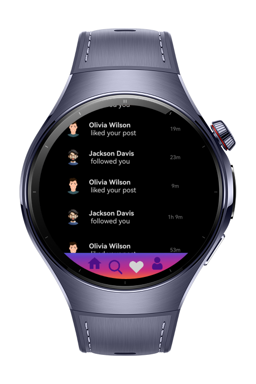
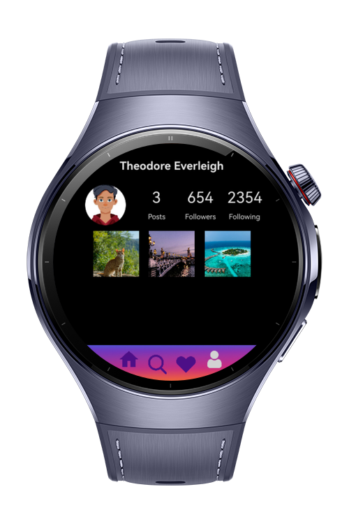

> **Note:** To access all shared projects, get information about environment setup, and view other guides, please visit [Explore-In-HMOS-Wearable Index](https://github.com/Explore-In-HMOS-Wearable/hmos-index).

# SocialMedia Wearable

Wearable-Sample App of Social Media is a smartwatch application built with HarmonyOS ArkTS/ArkUI, designed to give users
quick and intuitive access and reaction to social media timeline. With a clean interface and simple navigation, Social
Media app. Lets you browse timeline, notifications, and react—all from your wearable device.

# Preview

    
    
    
    

# Use Cases

- **Splash Page**: Welcome page of application
- **Menu Page**: First Menu
- **Main Page**: Navigation Container
- **Home Page**: Timeline
- **Search Page**: Search Page
- **Notification Page**: Notification Page
- **Profile Page**: Profile Page

# Tech Stack

- **Languages**: ArkTS
- **Frameworks**: HarmonyOS SDK 5.0.0(12)
- **Libraries**: @kit.ArkUI, @kit.ArkData

# Constraints and Restrictions

- CompatibleSDKVersion: 5.0.0(12)

## Suported Devices

- Huawei Watch 5

# License

**Social Media of wearable** is distributed under the terms of the MIT License
See the [LICENSE](./LICENSE) for more information.
